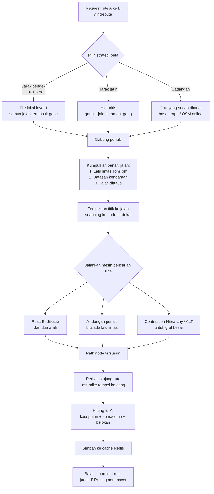
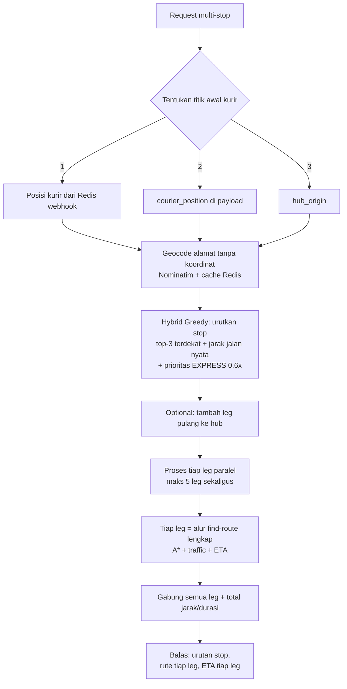

# Panduan Sederhana: Sistem Pencarian Rute (Pathfinding) & Pengantaran

---

## 1. Apa yang Dilakukan Sistem Ini?

Sistem ini bekerja seperti **aplikasi GPS untuk kurir logistik**. Ketika diberi dua titik
(contoh: dari Hub ke alamat penerima), sistem akan:

1. **Menentukan jalan mana yang harus dilewati** dari titik asal ke tujuan.
2. **Menghitung jarak** total rute.
3. **Memperkirakan waktu sampai (ETA)** — sudah mempertimbangkan kemacetan.
4. **Menggambar rute** di peta (kumpulan titik koordinat).
5. Untuk pengantaran banyak paket, sistem juga **mengurutkan urutan stop** yang paling efisien.

Sistem ini dibuat untuk aplikasi pengantaran paket B2B last-mile, jadi ada beberapa
"keahlian" khusus yang tidak dimiliki GPS biasa, seperti memprioritaskan paket EXPRESS,
memilih jalan sesuai jenis kendaraan (motor/mobil/truk), dan tahu jalan mana yang sedang
macet atau ditutup.

---

## 2. Dari Mana Peta Jalan Diambil?

Sistem tidak menyimpan peta berupa gambar, melainkan menyimpan **daftar ruas jalan**
berikut koordinat ujung-ujungnya. Data ini berasal dari **OpenStreetMap (OSM)** — peta
dunia terbuka — dalam beberapa bentuk:

| Bentuk Data | Penjelasan Sederhana | Kapan Dipakai |
|---|---|---|
| **File PBF asli** (`data/pbf/*.osm.pbf`) | "Buku peta lengkap" satu wilayah yang diunduh | Sumber utama, dipotong sesuai kebutuhan |
| **Tile lokal** (`data/tiles/`) | "Buku peta" yang sudah dipotong-potong kecil (kotak-kotak) agar cepat dibaca | Rute pendek (sekitar 0–10 km) |
| **Base Graph** | Ringkasan **jalan utama saja** (jalan tol, arteri, jalan besar) dari satu wilayah | Rute panjang, jadi penghubung antar kota |
| **OSM Online (Overpass)** | Unduh langsung dari internet saat dibutuhkan | Cadangan bila file lokal tidak ada |
| **Demo Grid** | Peta buatan (kotak-kotak) untuk pengujian | Pilihan terakhir saat semua di atas gagal |

Catatan penting: **jalan kecil/gang** (untuk rute presisi sampai depan alamat) hanya ada
di *tile lokal*. *Base graph* hanya berisi jalan utama agar cepat.

---

## 3. Konsep Dasar yang Perlu Diketahui

Supaya mudah mengikuti penjelasan berikut, kenali dulu istilah-istilah ini:

- **Node (simpul jalan)** — titik pertemuan/percabangan jalan. Analogi: *tikungan atau
  persimpangan di peta*.
- **Edge (ruas jalan)** — potongan jalan yang menghubungkan dua node. Analogi: *satu
  ruas jalan di antara dua persimpangan*.
- **Bobot (weight)** — "harga" untuk melewati satu ruas jalan, berupa **panjang jalan
  dalam meter**. Semakin panjang, semakin mahal.
- **Kelas jalan** — jenis jalan (jalan tol, jalan nasional, jalan kabupaten, jalan
  lokal/gang). Diambil dari tag OSM.
- **PathGraph** — istilah di dalam kode untuk "satu peta graf siap pakai" yang berisi
  semua node, ruas, kelas jalan, dan "peralatan" pencarian rutenya.
- **Snap (menempelkan titik ke jalan)** — karena titik asal/tujuan (GPS) hampir selalu
  *bukan* tepat di atas jalan, sistem "menempelkan" titik itu ke jalan terdekat.

---

## 4. "Model" / Algoritma yang Dipakai

Bagian ini inti dari pertanyaan "modelnya apa saja". Di dalam kode ada beberapa mesin
pencarian rute. Semuanya punya satu tujuan: **mencari jalan terpendek/tersingkat**.
Berikut penjelasan ramah-manusia untuk masing-masing.

### 4.1 A\* (dibaca "A-star")
**Analogi:** seperti seseorang yang berjalan sambil memegang kompas — ia selalu
mencoba bergerak ke arah tujuan, bukan mencoba ke segala arah. Jarak garis lurus ke
tujuan dipakai sebagai "petunjuk arah" sehingga pencarian tidak membuang waktu ke
tempat yang jauh dari tujuan.

**Kapan dipakai:** ketika rute dipengaruhi penalti lalu lintas, atau saat mesin lain
tidak tersedia. Ini mesin "cadangan utama" di Python.

### 4.2 Bidirectional Dijkstra (di dalam mesin Rust)
**Analogi:** dua orang berjalan — satu berangkat dari titik awal, satu lagi berangkat
dari titik tujuan — dan keduanya bertemu di tengah. Dengan cara ini pencarian dua kali
lebih cepat.

**Detail teknis (tambahan):** pencarian dari dua arah ini dijalankan di **mesin Rust**
(`src/lib.rs`) yang di-compile menjadi modul Python `_rust_engine`. Ini adalah mesin
tercepat dan menjadi **mesin utama** untuk menghitung rute.

### 4.3 Contraction Hierarchy (CH)
**Analogi:** seperti mempersiapkan "peta pintasan" sekali di awal. Jalan-jalan kecil
dirangkum ke dalam "pintasan" melewati persimpangan penting, sehingga nanti ketika
mencari rute, sistem hanya perlu melihat jalan-jalan penting saja. Hasilnya: pencarian
rute jauh menjadi sangat cepat.

**Kapan dipakai:** untuk peta yang **tidak satu arah** (jalan dua arah) dan berukuran
tidak terlalu besar. Pembuatannya dilakukan di `scripts/build_base_graph.py`.

### 4.4 ALT (Landmark + A\*)
**Analogi:** memakai beberapa "menara pemantau" di sudut-sudut kota yang jaraknya ke
setiap titik sudah dihitung sebelumnya. Saat mencari rute, jarak ke menara pemantau
ini membantu memandu pencarian lebih akurat daripada sekadar kompas biasa.

**Kapan dipakai:** saat Contraction Hierarchy tidak bisa dipakai (misalnya peta dengan
jalan satu arah). Menara (landmark) dipilih secara otomatis sebanyak 8 titik.

### 4.5 Rute Hierarkis 3 Lapis (untuk rute panjang)
**Analogi:** seperti merencanakan perjalanan antar kota:
1. Keluar dari **gang/jalan kecil** di titik awal,
2. Masuk ke **jalan utama** (base graph) untuk menempuh jarak jauh,
3. Keluar dari jalan utama masuk ke **gang/jalan kecil** menuju tujuan.

Titik pertemuan antara jalan kecil dan jalan utama disebut **portal** (gerbang).

**Kapan dipakai:** untuk rute yang cukup jauh, dengan syarat tersedia *tile lokal* dan
*base graph*. Rute dipecah menjadi 3 bagian: rute lokal asal → rute jalan utama → rute
lokal tujuan, lalu digabung menjadi satu rute utuh.

### 4.6 TSP / Hybrid Greedy + 2-opt (untuk pengantaran banyak paket)
**Analogi:** kurir punya 10 paket untuk 10 alamat. Sistem menyarankan **urutan**
pengantaran paling efisien dengan cara:
1. **Hybrid Greedy:** dari posisi sekarang, ambil 3 kandidat alamat terdekat
   (jarak garis lurus), hitung jarak jalan nyata untuk 3 kandidat itu, pilih yang
   paling efisien, lalu pindah ke alamat itu. Diulang sampai semua terantar.
   Persis perilaku kurir: "dari lokasi sekarang, cari yang paling dekat/efisien".
2. **2-opt:** perbaikan kecil — mencoba membalik sebagian urutan untuk melihat apakah
   hasilnya lebih pendek. Bila ya, dipakai.
3. **Prioritas EXPRESS:** paket EXPRESS diberi "diskon biaya" 0,6x sehingga cenderung
   diantar lebih dulu.

> Semua mesin di atas mencari rute berdasarkan **panjang jalan**. Untuk mencari
> **waktu**, lihat bagian Lalu Lintas & ETA (bagian 7).

---

## 5. Alur Rute dari Dua Titik (`/find-route`)

Berikut alur lengkap ketika aplikasi meminta rute dari titik A ke titik B.

Penjelasan langkah demi langkah:

1. **Pilih strategi peta** (`_resolve_plan`):
   - Jarak pendek (≤ ~10 km) dan ada tile lokal → pakai **tile lokal level 1** agar
     rute presisi sampai gang.
   - Jarak lebih jauh dan tersedia tile + base graph → pakai **rute hierarkis**.
   - Selain itu → pakai graf yang sudah dimuat sebelumnya, base graph, atau unduh OSM.
   - Bila semua tidak tersedia → area di luar cakupan peta (error 400).

2. **Kumpulkan penalti jalan** — "denda" untuk ruas jalan tertentu:
   - **Lalu lintas (TomTom):** ruas macet diberi pengali (multiplier), mis. 2,5x
     berarti 2,5 kali lebih lambat. Ruas ditutup diberi nilai tak hingga (∞) sehingga
     tidak dilewati.
   - **Batasan kendaraan:** motor tidak boleh di jalan tol, truk tidak boleh masuk
     gang → ruas itu "diblokir".
   - Gabungan penalti ini membuat mesin pencari rute menghindari jalan buruk.

3. **Snapping** — titik A dan B ditempelkan ke node jalan terdekat (maksimal 1.500 m).

4. **Jalankan mesin** — urutan prioritas: Rust (bi-directional Dijkstra) → kalau ada
   penalti, pakai A\* → kalau graf cocok, pakai Contraction Hierarchy/ALT.

5. **Rute tidak ketemu?** Sistem coba menyelamatkan: mencari node tujuan lain yang
   terjangkau di sekitar titik tujuan, atau menyesuaikan titik asal.

6. **Last-mile** — ujung rute (awal & akhir) ditempelkan presisi ke gang di dekat
   alamat, sehingga titik rute benar-benar sampai depan pintu.

7. **ETA** — dihitung dari total jarak dibagi kecepatan rata-rata kendaraan, dikalikan
   tingkat kemacetan, ditambah penalti tiap belokan dan waktu layanan.

8. **Cache Redis** — hasil rute disimpan 5 menit. Request yang sama berikutnya langsung
   dijawab dari cache, tanpa menghitung ulang.

9. **Respons** — kumpulan koordinat rute (di-encode sebagai polyline), total jarak,
   ETA, dan daftar segmen yang macet.

---

## 6. Alur Rute Multi-Stop (Pengantaran Banyak Paket)

Endpoint `/find-optimized-delivery-route` untuk kasus **satu kurir, banyak paket**.

### 6.1 Titik awal rute (urutan prioritas)
1. **Posisi kurir terbaru** dari Redis `driver:pos:{kurir_id}` (dikirim via WebSocket
   / Webhook) — prioritas tertinggi.
2. **`courier_position`** di dalam request — dipakai bila posisi Redis tidak ada.
3. **`hub_origin`** (lokasi Hub) — pilihan terakhir.

### 6.2 Alur lengkap

Penjelasan:

1. **Tentukan titik awal** sesuai prioritas di atas.
2. **Geocode** — alamat tanpa koordinat diterjemahkan menjadi lat/long (via layanan
   Nominatim, hasilnya di-cache di Redis).
3. **Urutkan stop (hybrid greedy)** — dari posisi sekarang ambil 3 kandidat terdekat,
   hitung jarak jalan nyata untuk 3 kandidat (pakai cache rute Redis agar cepat),
   pilih yang paling efisien; paket EXPRESS diprioritaskan. Ulangi sampai semua stop.
4. **Opsional pulang ke Hub** (`return_to_hub`) — tambahkan leg terakhir kembali ke Hub.
5. **Hitung leg secara paralel** — tiap pasangan stop dihitung sebagai satu rute
   (alur di bagian 5), dengan maksimal 5 leg dikerjakan bersamaan.
6. **Gabungkan hasil** — total jarak, total durasi, dan daftar rute per leg.

---

## 7. Lalu Lintas & Perkiraan Waktu (ETA)

### 7.1 Cara tahu macet
Sistem memakai **TomTom Traffic** sebagai penyedia data lalu lintas:

- Sebelum menghitung rute, sistem **mengebor (probe)** beberapa titik di sekitar jalur
  A–B untuk menanyakan kondisi lalu lintas.
- Hasilnya berupa **penalti per ruas jalan** yang disimpan di Redis (`traffic:penalties`).
- Setelah rute awal dihitung, sistem bisa **mengecek koridor rute**; bila ada
  kemacetan besar, rute **dihitung ulang** secara instan.
- Penalti memengaruhi **durasi** dan **pilihan jalan**, bukan sekadar tampilan.

### 7.2 Jenis gangguan jalan
| Jenis | Arti | Dampak |
|---|---|---|
| **Kemacetan (congestion)** | Jalan ramai | Pengali 1,5x+ pada ruas tersebut; dilaporkan sebagai "segmen macet" |
| **Penutupan jalan (closure)** | Jalan ditutup | Pengali tak hingga (∞) → rute otomatis menghindari |

### 7.3 Cara menghitung ETA
Perkiraan waktu tiba dihitung dari:
1. **Total jarak** dibagi **kecepatan rata-rata** kendaraan (default 40 km/jam; bisa
   diatur per jenis kendaraan).
2. Dikali **tingkat kemacetan** rata-rata di sepanjang rute.
3. Ditambah **penalti belokan** (tiap belokan tajam ≈ +5 detik).
4. Ditambah **waktu layanan** (berhenti menyerahkan paket ≈ 3 menit).

---

## 8. Rute Alternatif (`/find-route-options`)

Untuk memberi beberapa pilihan rute (mis. "Cepat tapi jauh" vs "Lurus tapi macet"):

1. Hitung **rute terbaik** dulu.
2. Untuk alternatif berikutnya, beri **denda besar (8x)** pada ruas jalan yang sudah
   dipakai rute sebelumnya, lalu hitung ulang — hasilnya jalur yang berbeda.
3. Alternatif yang **terlalu mirip** (tumpang tindih > 70%) dibuang.
4. Maksimal 3 alternatif (bisa diubah lewat pengaturan).

---

## 9. Cadangan & Penyelamatan (Fallback)

Sistem dirancang agar "tidak mudah menyerah":

- **Tujuan tidak terjangkau** (mis. semua jalan menuju tujuan diblokir macet) → sistem
  mencari **titik terdekat lain** yang masih bisa dicapai di sekitar tujuan.
- **Mode kendaraan gagal** (mis. truk tidak bisa lewat) → otomatis **coba pakai mode
  mobil (car)**.
- **Peta hierarkis gagal dimuat** → **fallback ke graf biasa** (base graph).
- **Data peta lokal tidak ada** → **unduh OSM online** atau pakai **demo grid**.
- Semua hasil disertai **peringatan (warning)** agar pengguna tahu ada penyesuaian.

---

## 10. Kamus Istilah Singkat

| Istilah Teknis | Arti Sehari-hari |
|---|---|
| Node | Titik persimpangan/percabangan jalan |
| Edge | Satu ruas jalan di antara dua titik |
| Weight | "Harga" ruas jalan = panjang dalam meter |
| A\* | Pencarian rute berpandu kompas (jarak garis lurus ke tujuan) |
| Dijkstra | Pencarian rute ke segala arah, tanpa panduan |
| Bidirectional | Pencarian dari awal dan tujuan sekaligus sampai bertemu |
| Contraction Hierarchy | Peta yang dipadatkan dengan pintasan agar cepat |
| ALT / Landmark | Pencarian dibantu "menara pemantau" di sudut kota |
| Hierarkis | Rute panjang dipecah: gang → jalan utama → gang |
| Snap | Menempelkan titik GPS ke jalan terdekat |
| Portal | Titik pertemuan jalan kecil dan jalan utama |
| Penalty (penalti) | "Denda" pada ruas jalan agar dihindari pencari rute |
| Multiplier | Pengali waktu (macet = mis. 2x lebih lambat) |
| Hybrid Greedy | Strategi "selalu cari yang terdekat/efisien" dari posisi sekarang |
| 2-opt | Perbaikan urutan rute dengan membalik sebagian jalur |
| ETA | Estimasi waktu tiba |
| Polyline | Cara meringkas kumpulan koordinat menjadi satu teks |
| Geocode | Menerjemahkan alamat teks menjadi koordinat |
| Geofence | Radius "lingkaran" di sekitar satu titik (default 30 m) |
| Redis | Penyimpanan cepat di memori untuk cache rute & posisi |

---

## 11. Gambaran Besar: Satu Paragraf

Sistem ini seperti **GPS yang pintar untuk kurir logistik**: ia membaca peta jalan
dari OpenStreetMap (file lokal maupun online), memilih strategi yang tepat sesuai
jarak (gang untuk jarak dekat, jalan utama untuk jarak jauh), menggabungkan informasi
kemacetan TomTom dan batasan kendaraan, lalu mencari rute terbaik dengan mesin
tercepat (Rust), dibantu algoritma pintar (A\*, Contraction Hierarchy, ALT). Untuk
pengantaran banyak paket, sistem mengurutkan alamat paling efisien sambil tetap
memprioritaskan paket EXPRESS, menghitung rute dan ETA tiap perhentian secara paralel,
dan selalu punya rencana cadangan bila ada jalan macet atau ditutup. Hasilnya: rute
yang akurat, cepat dihitung, dan mudah dipahami oleh kurir di lapangan.