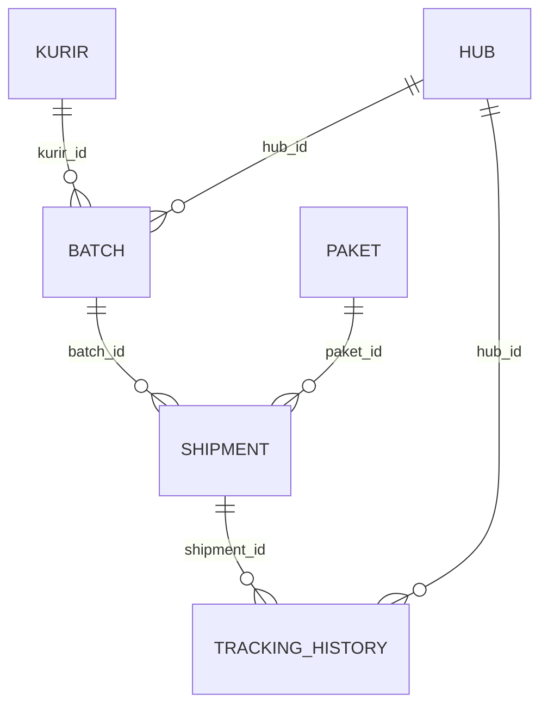

# Plan: Response Bisnis Paket

**Status:** Rencana (belum dieksekusi)
**Tanggal:** 2026-08-13
**Scope:** Batch pengiriman + response API bisnis paket + hub + COD + billing + tracker + login kurir

---

## 1. Latar belakang & tujuan

- Kebutuhan: "response bisnis paket" — desain respons API untuk fitur bisnis pengiriman
  (assign paket ke kurir, tracking status), dengan format respons seragam
  `{"success": true, "message": "...", "data": ...}`.
- Requirement tambahan:
  - **login kurir** — autentikasi sederhana (JWT) agar kurir bisa lihat
    batch/tugasnya sendiri;
  - **COD** (Cash on Delivery), **billing** (biaya kirim ke customer), dan **hub**
    (titik sortir/distribusi) sebagai concern bisnis yang ditambal;
  - **tracker paket** — timeline history (mis. dari Hub Semarang → Hub Kudus) +
    status terkini; bukan GPS real-time.
- Kurir mengirim paket **per batch** (1 batch = 20–30+ paket) → perlu entitas
  `batch` eksplisit sebagai unit tugas kurir.

## 2. Keputusan desain (sudah dikonfirmasi)

| Topik | Keputusan |
|---|---|
| Entitas kurir | Tabel `kurir` terpisah (bukan field string di shipment) |
| Scope login | **Kurir aja** (tanpa owner multi-user) |
| Metode auth | JWT access token (HS256); password di-hash **bcrypt** |
| Kolom auth | `username` + `password_hash` di tabel `kurir` (dikerjakan sekarang) |
| Otorisasi | Kurir hanya melihat batch/shipment miliknya sendiri (`is_active=False` = akun nonaktif) |
| Granularitas status | Batch **dan** per-paket (dua-duanya ada) |
| Batch per kurir | 1 kurir = 1 batch aktif (assign baru → 409) |
| `batch_no` | Format tanggal: `BATCH-YYYYMMDD-0001` |
| Batch `delivered` | Manual — kurir nyatakan via PATCH |
| Batch `picked_up` | Kolektif — semua shipment di batch ikut `picked_up` |
| Re-assign | Paket dengan shipment aktif → 409 (belum dukung re-assign otomatis) |
| `hub_id` di batch | **Opsional** — assign tetep jalan walau hub belum diisi |
| `ongkir` | Dummy dulu di seed (mis. 15000), bukan standar tarif resmi |
| Tracker | Dari sistem kita sendiri (mode mandiri); kalaupun dilempar ke pihak ketiga, data history tetap bisa dikirim |
| Event tracker | Lifecycle otomatis + transit antar hub (`received_at_hub`/`departed_hub`) manual |
| SOURCE tracker | Bukan GPS real-time; berbasis event update status |

## 3. Struktur data

```
kurir                          hub
├── id PK                      ├── id PK
├── nama String(255)           ├── nama String(255)
├── nomor_telepon String(20)   ├── alamat String(500) nullable
│   (unique)                   ├── latitude Float nullable
├── kendaraan String(20)       ├── longitude Float nullable
├── is_active Boolean          └── is_active Boolean default True
├── username String(50) unique
├── password_hash String(255)
└── created_at

paket                          batch                            shipment (per-paket)
├── id PK                      ├── id PK                        ├── id PK
├── ... (existing)             ├── batch_no String(32) unique   ├── batch_id FK → batch.id, indexed
├── ongkir Float default 0     ├── kurir_id FK → kurir.id, idx   ├── paket_id FK → paket.id, indexed
│   (field BARU)               ├── hub_id FK → hub.id, nullable ├── status: assigned |
│                              ├── status: assigned |           │   picked_up | delivered |
│                              │   picked_up | delivered |      │   failed | returned
│                              │   returned                     ├── cod_status: pending |
│                              ├── assigned_at                  │   collected | remitted |
│                              ├── picked_up_at nullable        │   not_applicable
│                              ├── delivered_at nullable        ├── cod_amount Float nullable
│                              └── assigned_by String(50),      ├── cod_collected_at nullable
│                                  default "owner"              ├── cod_remitted_at nullable
│                                                               ├── ongkir Float default 0
│                                                               ├── billing_status: unpaid |
│                                                               │   paid | refunded
│                                                               ├── billing_paid_at nullable
│                                                               ├── picked_up_at nullable
│                                                               └── delivered_at nullable

tracking_history
├── id PK
├── shipment_id FK → shipment.id, indexed
├── event String(50): received_at_hub | departed_hub |
│   picked_up | delivered | failed | returned
├── keterangan String(255) nullable
├── hub_id FK → hub.id nullable        # event terjadi di hub mana
└── created_at
```

Diagram relasi:



Catatan:
- `kurir` menyimpan kredensial login: `username` (unique) + `password_hash`
  (bcrypt). `is_active=False` = akun login dinonaktifkan.
- `shipment` tidak menyimpan `kurir_id` — kurir diturunkan lewat `batch`.
- `batch_no` dibuat otomatis dari tanggal server: `BATCH-YYYYMMDD-XXXX`
  (XXXX = urutan harian, mulai 0001).
- **Data penerima** sudah ada di `paket.nama` / `paket.nomor_telepon` / `paket.alamat`
  — tidak ada tabel tambahan.
- `shipment.cod_amount` & `shipment.ongkir` = salinan dari `paket` saat assign,
  biar riwayat tidak berubah meski master paket diedit.
- `tracking_history` ditulis otomatis oleh transisi status (`picked_up`/`delivered`
  `/failed`/`returned`); event transit hub (`received_at_hub`/`departed_hub`) diinput
  manual via POST history.

## 4. Aturan status & transisi

### Batch
```
assigned ──► picked_up ──► delivered
    │              │
    └──────────────┴──► returned   (batch batal)
```

### Shipment (per-paket)
```
assigned ──► picked_up ──► delivered
                     │
                     ├──► failed
                     └──► returned
```

### COD
```
pending ──► collected ──► remitted
    │
    └──► not_applicable   (shipment failed/returned, uang tak ditarik)
```
- Assign paket `cod=True` → `cod_status=pending`, `cod_amount=paket.harga`.
- Shipment → `delivered` → otomatis `collected` + `cod_collected_at`.
- Kurir setor ke owner → PATCH COD → `remitted` + `cod_remitted_at`.

### Billing
```
unpaid ──► paid
    └──► refunded
```
- Assign → `ongkir` disalin dari `paket.ongkir`, `billing_status=unpaid`.
- PATCH billing → `paid` / `refunded` + `billing_paid_at`.

### Aturan tracker
- Setiap transisi status shipment otomatis menulis `tracking_history`.
- Event transit hub (`received_at_hub`/`departed_hub`) diinput manual.
- Output tracker = `{resi, status, history: [...]}` — bukan data GPS real-time.

### Aturan umum
1. **Pickup kolektif**: batch di-PATCH ke `picked_up` → semua shipment di dalamnya
   otomatis `picked_up`.
2. **Pengiriman per-paket**: kurir update status shipment satu-satu
   (`delivered` / `failed` / `returned`).
3. **Satu batch aktif per kurir**: kurir yang masih punya batch `assigned`/`picked_up`
   → ditolak membuat batch baru (409).
4. **Paket tidak boleh dobel**: paket yang sudah punya shipment aktif
   (`assigned`/`picked_up`) → ditolak di-assign lagi (409).
5. **Batch `delivered` manual**: kurir nyatakan batch selesai; paket `failed`/`returned`
   tetap tercatat di shipment masing-masing.

## 5. Endpoint API

| Method | Path | Fungsi |
|---|---|---|
| POST | `/api/v1/batches` | Assign N paket (`paket_ids` + `kurir_id` + [`hub_id`]) → buat 1 batch + shipment per paket |
| GET | `/api/v1/batches` | List batch, filter `?status=` `?kurir_id=` `?hub_id=` |
| GET | `/api/v1/batches/{id}` | Detail batch + daftar shipment/paket di dalamnya |
| PATCH | `/api/v1/batches/{id}/status` | Status level batch (`picked_up`/`delivered`/`returned`) |
| GET | `/api/v1/shipments` | List shipment, filter `?status=` `?batch_id=` `?kurir_id=` |
| GET | `/api/v1/shipments/{id}` | Detail shipment (termasuk COD + billing) |
| GET | `/api/v1/shipments/{id}/tracking` | Tracker history (timeline event + status) |
| POST | `/api/v1/shipments/{id}/history` | Event manual transit hub (`received_at_hub`/`departed_hub`) |
| PATCH | `/api/v1/shipments/{id}/status` | Status per-paket (`picked_up`/`delivered`/`failed`/`returned`) |
| PATCH | `/api/v1/shipments/{id}/cod` | Tandai COD `remitted` |
| PATCH | `/api/v1/shipments/{id}/billing` | Tandai billing `paid`/`refunded` |
| GET | `/api/v1/kurir` | List kurir aktif (buat dropdown assign) |
| GET | `/api/v1/hubs` | List hub aktif (buat dropdown assign) |
| POST | `/api/v1/auth/login` | Login kurir → JWT token + data kurir |
| GET | `/api/v1/auth/me` | Info kurir yang login (Bearer token) |

### Format response seragam

Sukses (200/201):
```json
{
  "success": true,
  "message": "...",
  "data": { ... }
}
```

Error:
```json
{
  "success": false,
  "message": "..."
}
```

Status code:
- `201` — batch berhasil dibuat
- `200` — sukses (list/detail/update)
- `404` — paket / batch / shipment tidak ditemukan
- `409` — paket punya shipment aktif, atau kurir masih punya batch aktif
- `422` — status invalid

### Contoh respons assign

```json
{
  "success": true,
  "message": "Batch BATCH-20260813-0001 dibuat: 3 paket di-assign ke kurir Joko",
  "data": {
    "batch": {
      "id": 1,
      "batch_no": "BATCH-20260813-0001",
      "status": "assigned",
      "assigned_at": "2026-08-13T07:00:00Z",
      "hub": { "id": 1, "nama": "Hub Kudus", "alamat": "Jl. Raya Kudus" },
      "kurir": {
        "id": 1,
        "nama": "Joko",
        "nomor_telepon": "081234567890",
        "kendaraan": "motorcycle"
      }
    },
    "shipments": [
      {
        "shipment_id": 1,
        "resi": "RESI-2026-0001",
        "paket": {
          "id": 1,
          "nama": "Budi Santoso",
          "alamat": "Jl. Sukun Raya No.09, Kudus",
          "jenis_pengiriman": "reguler"
        },
        "status": "assigned",
        "cod": { "status": "pending", "amount": 250000 },
        "billing": { "ongkir": 15000, "status": "unpaid" }
      },
      {
        "shipment_id": 2,
        "resi": "RESI-2026-0002",
        "paket": {
          "id": 2,
          "nama": "Siti Rahayu",
          "alamat": "Jl. Bae-Besito, Kudus",
          "jenis_pengiriman": "express"
        },
        "status": "assigned",
        "cod": { "status": "not_applicable", "amount": null },
        "billing": { "ongkir": 15000, "status": "unpaid" }
      }
    ]
  }
}
```

### Contoh respons tracker

```json
{
  "success": true,
  "data": {
    "resi": "RESI-2026-0001",
    "status": "delivered",
    "history": [
      {
        "event": "received_at_hub",
        "keterangan": "Paket diterima di Hub Semarang",
        "hub": { "id": 2, "nama": "Hub Semarang" },
        "waktu": "2026-08-13T08:00:00Z"
      },
      {
        "event": "departed_hub",
        "keterangan": "Paket keluar dari Hub Semarang",
        "hub": { "id": 2, "nama": "Hub Semarang" },
        "waktu": "2026-08-13T11:00:00Z"
      },
      {
        "event": "received_at_hub",
        "keterangan": "Paket tiba di Hub Kudus",
        "hub": { "id": 1, "nama": "Hub Kudus" },
        "waktu": "2026-08-13T14:00:00Z"
      },
      {
        "event": "picked_up",
        "keterangan": "Dijemput kurir Joko",
        "hub": { "id": 1, "nama": "Hub Kudus" },
        "waktu": "2026-08-13T15:00:00Z"
      },
      {
        "event": "delivered",
        "keterangan": "Paket diterima penerima (Budi Santoso)",
        "hub": null,
        "waktu": "2026-08-13T17:30:00Z"
      }
    ]
  }
}
```

### Contoh respons login

```json
POST /api/v1/auth/login
{
  "username": "joko",
  "password": "rahasia123"
}
```

```json
{
  "success": true,
  "message": "Login berhasil",
  "data": {
    "token": "eyJhbGciOiJIUzI1NiIs...",
    "kurir": {
      "id": 1,
      "nama": "Joko",
      "username": "joko",
      "nomor_telepon": "081234567890",
      "kendaraan": "motorcycle"
    }
  }
}
```

Error (401, kredensial salah atau akun nonaktif):
```json
{
  "success": false,
  "message": "Username atau password salah"
}
```

## 6. File yang dibuat / diubah

| File | Aksi | Isi |
|---|---|---|
| `app/models/kurir.py` | baru | Model `Kurir` |
| `app/models/hub.py` | baru | Model `Hub` |
| `app/models/batch.py` | baru | Model `Batch` |
| `app/models/shipment.py` | baru | Model `Shipment` (status + COD + billing) |
| `app/models/tracking_history.py` | baru | Model `TrackingHistory` |
| `app/models/paket.py` | ubah | Tambah kolom `ongkir` |
| `app/core/database.py` | ubah | Register model baru di `init_db()` |
| `app/schemas/*` | baru | Schema batch / shipment / hub / tracking |
| `app/api/v1/endpoints/shipments.py` | baru | Router batch, shipment, COD, billing, tracking |
| `app/core/security.py` | baru | Hash/verifikasi password (bcrypt) + bikin/validasi JWT |
| `app/schemas/auth.py` | baru | Schema login request/response, auth me |
| `app/api/v1/endpoints/auth.py` | baru | Endpoint `login` & `me` |
| `app/api/v1/router.py` | ubah | Register router shipment + auth |
| `scripts/seed_kurir.py` | baru | Seed 3 kurir dummy + `username` & `password_hash` (buat login) |
| `scripts/seed_hub.py` | baru | Seed 3 hub dummy |
| `scripts/seed_paket.py` | ubah | Tambah `ongkir` dummy (mis. 15000) |
| `pyproject.toml` | ubah | Dependency baru: `bcrypt`, `PyJWT` (atau `python-jose`) |
| `.env.example` | ubah | Tambah `JWT_SECRET`, `JWT_EXPIRE_MINUTES` |

## 7. Rencana verifikasi

1. Seed: `scripts/seed_kurir.py`, `scripts/seed_hub.py`, `scripts/seed_paket.py`
   (dengan `ongkir`) → tabel dibuat + data terisi.
2. `POST /api/v1/batches` (`kurir_id`=1, `paket_ids`=[1,2,3], `hub_id`=1)
   → `201`, cek format respons (batch + hub + kurir + shipment + cod + billing).
3. `POST /api/v1/batches` lagi untuk kurir yang sama → `409` (batch aktif).
4. Assign paket yang sudah punya shipment aktif → `409`.
5. `PATCH /api/v1/batches/1/status` → `picked_up` → semua shipment ikut `picked_up`,
   history `picked_up` ter-record.
6. `PATCH /api/v1/shipments/1/status` → `delivered` → COD otomatis `collected`;
   `shipments/2` → `failed` (per-paket independen), COD `not_applicable`.
7. `POST /api/v1/shipments/1/history` → event manual `received_at_hub`/`departed_hub`.
8. `GET /api/v1/shipments/1/tracking` → timeline history lengkap.
9. `PATCH /api/v1/shipments/1/cod` → `remitted`; `PATCH .../1/billing` → `paid`.
10. `PATCH /api/v1/batches/1/status` → `delivered` (manual).
11. `GET /api/v1/batches/1`, `GET /api/v1/shipments?status=delivered`,
    `GET /api/v1/kurir`, `GET /api/v1/hubs`.
12. Status invalid → `422`; ID tidak ada → `404`.
13. `POST /api/v1/auth/login` — username/password benar → `200` + token;
    salah / akun nonaktif → `401`.
14. `GET /api/v1/auth/me` pakai Bearer token → data kurir; tanpa/jelek token → `401`.
15. `GET /api/v1/batches` dengan token kurir → hanya batch miliknya (filter by kurir_id dari token).

## 8. Catatan & keputusan terbuka (kalau ada)

- **Re-assign paket**: saat ini paket dengan shipment aktif ditolak (409).
  Kalau nanti butuh re-assign otomatis (shipment lama di-`returned`, buat baru),
  perlu diskusi tambahan.
- **Auth**: JWT + bcrypt; `JWT_SECRET` wajib di-set di `.env`. Refresh token belum
  ada (token kedaluwarsa manual lewat `JWT_EXPIRE_MINUTES`). Otorisasi dasar:
  endpoint milik kurir memakai `kurir_id` dari token.
- **Role**: hanya kurir yang login (tidak ada owner multi-user). `assigned_by`
  di `batch` default `"owner"`.
- **Ongkir**: masih nilai dummy; standar tarif resmi menyusul.
- **Tracker**: mode mandiri dari sistem kita. Kalau nanti integrasi dengan
  ekspedisi pihak ketiga, `tracking_history` tetap bisa menjadi sumber data yang
  dikirim.